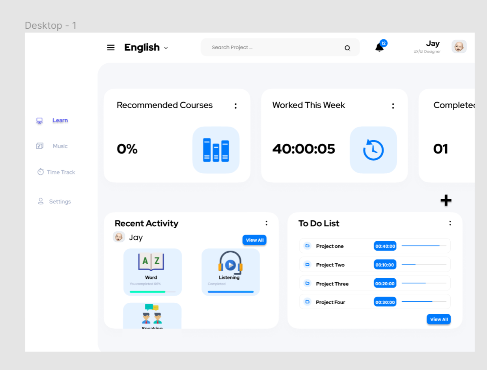
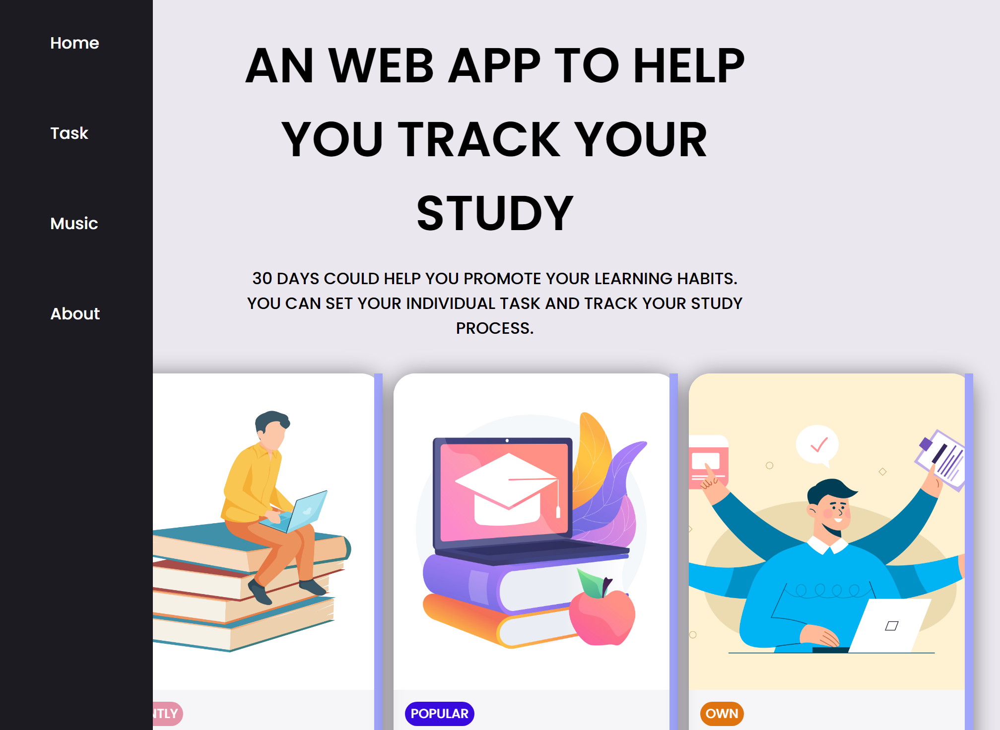

# 30 Days - Set Up Your Own learning Tasks
This software is designed for promote learning habits. Users allow to set and prioritise tasks, help them divide and manage their study tasks. At the same time user can relax by playing music through the music player

## Contents of Readme File
 * __Change of design brief__
 * __Code Description__
 * __How to use__
 * __Reference__


## Change of design brief
My original idea in the previous design brief was to design a language learning software where the user could look up words using a dictionary and set time tracking to help them more concentration. However, I delete the time tracking idea, I thought if users who want to set study times, I think they may prefer to use them on their mobile phones rather than the web side. Thus, the final web application will be more focus on task management and music player those two features.

* __screenshot of the layout change__

orginal layout


new layout



## Dode Description

the detail description of the code I use
The basic framework of the website I refer to some templates, refer to the following websites [CODEPEN](https://codepen.io/trending)

* __Folded menu bar__

For the menu bar added a collapse effect, I didn't use js to achieve this, I referenced  [Areal Alien's](https://codepen.io/areal_alien/pen/BaRpxdX) code and added the effect to it in  **css**.

```CSS
  /*folded menu bar*/
  .flexbox {
      display: flex;
      justify-content: center;
      align-items: center;
  }
  .flexbox-left {
      display: flex;
      justify-content: flex-start;
      align-items: center;
  }
  .flexbox-right {
      display: flex;
      justify-content: flex-end;
      align-items: center;
  }
  /* left Columns of the menu */
  .flexbox-col {
      display: flex;
      justify-content: center;
      flex-direction: column;
      align-items: center;
  }
  .flexbox-col-left {
      display: flex;
      justify-content: flex-start;
      flex-direction: column;
      align-items: flex-start;
  }
  .flexbox-col-left-ns {
      display: flex;
      justify-content: center;
      flex-direction: column;
      align-items: flex-start;
  }
  .flexbox-col-right {
      display: flex;
      justify-content: flex-end;
      flex-direction: column;
      align-items: flex-end;
  }
  .flexbox-col-start-center {
      display: flex;
      justify-content: flex-start;
      flex-direction: column;
      align-items: center;
  }
  /* Spacings */
  .flexbox-space-bet {
      display: flex;
      justify-content: space-between;
      align-items: center;
  }
```

* __Homepage Card Layout__

The card layout is also reference from [jpmersuglia, 2020](https://github.com/jpmersuglia/responsive-cards-layout.git)
the card add :hover special styles to the mouse, so that when user's mouse put on the cards, it will change the color.

```css
.card {
    overflow: auto;  /*If the card content is trimmed, the browser displays a scroll bar to view the rest of the content*/
    background-color: rgba(255, 255, 255, 0.586);
    border-radius: 20px;
    box-shadow: 0 2px 20px rgba(0, 0, 0, 0.491);
    top: 150px;;
}

//the card will change text and background color when mouse put on the cards
.card:hover{
    background-color: #000000;
    border-radius: 10px;
    box-shadow: 0 2px 20px rgba(0,0,0,0.4);
    color:#fff; //text color will change
}
```

* __Menu bar text change color__

I have added hyperlinks to the text in the menu bar so that the user can click on it to jump to the page. So I have added a hover effect to the menu text page, following jpmersuglia's code, where the underline and colour changes when the mouse is placed over the text to prompt the user.

```html
<li class="navbar-item flexbox-left">
  <div class="navbar-item-inner-icon-wrapper flexbox"></div>
  <span class="link-text">
    <a href="index.html" id="mentext">  //add hoverto menu text
      Home
    </a>
  </span>
</li>
```

```css
  /*Because the text in the menu bar is underlined after being added hyperlinked, 
  in order to change the color i use ID='mentext' to label a particular style
  */
  #mentext{
    text-decoration:none;
    color: white;
  }
  #mentext:hover {
    opacity: 3;
    text-decoration:underline;
    color: rgb(161, 166, 252);
}
```

* __Form validation__

By studying [Chengjun's](https://chinese.freecodecamp.org/news/form-validation-with-html5-and-javascript/) code, I used JavaScript to validate the data entered by the user in the submit form. Verify that the data entered by the user is it empty or correct email address?

Triggers the submission of the form by clicking on it, while using document.getElementById looks for the user's input value and store the value entered by the user in the UserNameField.

```javascript
submit.addEventListener("click", validate);

function validate(e) {
  e.preventDefault();

  const UserNameField = document.getElementById("firstname");
  let valid = true;

  if (!UserNameField.value) {
 ........
  }
  
  return valid;
}
```
Once the input is incorrect, javascript will run those function an error message will pop up until return valid value.

```javascript
 if (!UserNameField.value) {
    const nameError = document.getElementById("nameError");
    nameError.classList.add("loading");
    UserNameField.classList.add("invalid");
    nameError.setAttribute("aria-hidden", false);
    nameError.setAttribute("aria-invalid", true);
  }
```


### Reference (APA6th)
  3D form validation. (n.d.). Retrieved June 5, 2022, from CodePen website: https://codepen.io/soulrider911/pen/DdeGao

  Alien, A. (n.d.). Sticky responsive sidenav. Retrieved June 5, 2022, from CodePen website: https://codepen.io/areal_alien/pen/BaRpxdX

  Bohannon. (n.d.). 网易云音乐. Retrieved June 5, 2022, from 网易云音乐 website: https://music.163.com/#/song?id=2714997

  Cha Cha Cha. (n.d.). Retrieved June 5, 2022, from Discogs website: https://www.discogs.com/release/572435-Finzy-Kontini-Cha-Cha-Cha

  Chengjun.L. (2021, April 23). 数据验证——使用示例 javascript 代码检查 HTML 表单上的用户输入. FreeCodeCamp.Org. Retrieved from https://chinese.freecodecamp.org/news/form-validation-with-html5-and-javascript/

  jpmersuglia. (2020, September 2). Build software better, together. Retrieved June 5, 2022, from GitHub website: https://github.com/jpmersuglia/responsive-cards-layout/projects?type=beta

  Queen   I want to break free.mp3. (n.d.). Retrieved June 5, 2022, from Google Docs website: https://docs.google.com/file/d/0B0oHLwB1TKEmSG5fM3VhVUhLQjg/view?resourcekey=0-FmMQQr1Dwx_TOuVeXGObig

  Slotnik, D. E. (2020, May 2). Hamilton Bohannon, driving disco drummer, dies at 78. The New York Times. Retrieved from https://www.nytimes.com/2020/05/02/arts/music/hamilton-bohannon-dead.html

  Sticky responsive sidenav. (n.d.). Retrieved June 5, 2022, from CodePen website: https://codepen.io/areal_alien/pen/BaRpxdX
